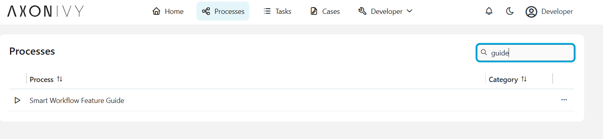
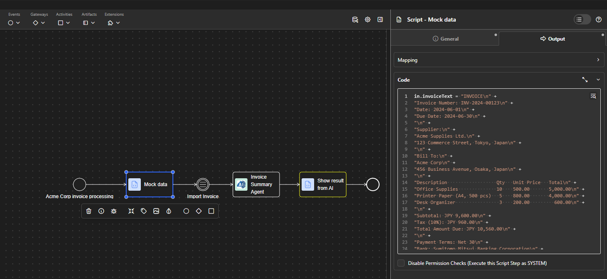
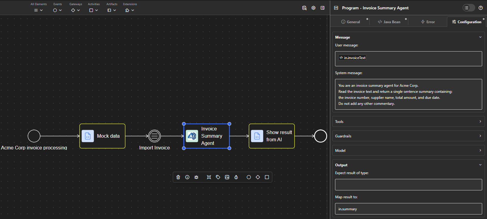
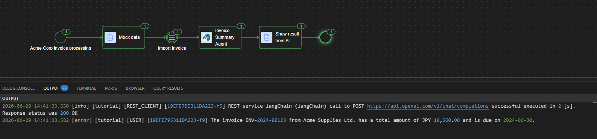

# Axon Ivy Smart Workflow Tutorial

---

## English

This is a tutorial project for **Axon Ivy Smart Workflow** developers. It is intended for developers who have foundational knowledge of Java and experience developing Axon Ivy projects.

### Prerequisites

- Java development experience
- Familiarity with Axon Ivy project development

### Versions

| Component | Version |
|---|---|
| Axon Ivy Engine | [Nightly Engine 05.06.2026](https://download.axonivy.com/nightly/AxonIvyEngine14.0.0.2608050112_Slim_All_x64.zip) |
| Smart Workflow | In this repo |

### Project Structure

```
tutorial-repo/
├── models/          # Supported Smart Workflow AI model providers
├── smart-workflow/  # Core project of Axon Ivy Smart Workflow
└── tutorial/        # Tutorial Axon Ivy project
```

### Smart Workflow Feature Guide

The Feature Guide is an interactive documentation viewer built into the tutorial project. To open it, go to the Process list in Axon Ivy Designer and start the **Smart Workflow Feature Guide** process.



### Tutorial Processes

Each feature in the `tutorial` project has a dedicated demo process that you can run directly in the Designer. Every process follows the same structure:

**Mock data element** — Pre-fills the process input so you can run the process without any manual data entry. Modify the values inside to test the agent with your own data.



**Agent element** — The `AgenticProcessCall` element containing the AI configuration for that feature: system prompt, query, provider, tools, and result mapping. Double-click it to inspect or change the configuration.



**Show result element** — Logs the agent's response to the Axon Ivy Runtime Log after each run. To inspect the output, open the **Output** tab in the Designer and switch to the **Axon Ivy Runtime Log** view.



### Export Documentation

The Feature Guide includes an **⬇ Export** button in the navigation bar. Clicking it downloads a `tutorial-docs.zip` file containing all feature documentation and images as standalone Markdown files — ready to read in any Markdown viewer or share without an Axon Ivy runtime.

The ZIP has the following structure:

```
tutorial-docs.zip
├── en/
│   ├── feature-01.md
│   └── … feature-07.md
├── jp/
│   ├── feature-01.md
│   └── … feature-07.md
└── images/
    └── *.png
```

All `cms:/` image references in the markdown files are automatically rewritten to relative paths (`../images/xxx.png`) so images render correctly when opened locally.

---

## 日本語

これは **Axon Ivy Smart Workflow** 開発者向けのチュートリアルプロジェクトです。Java の基礎知識と Axon Ivy プロジェクト開発の経験を持つ開発者を対象としています。

### 前提条件

- Java 開発の経験
- Axon Ivy プロジェクト開発の知識

### バージョン

| コンポーネント | バージョン |
|---|---|
| Axon Ivy Engine | [スプリントリリース 05.06.2026](https://download.axonivy.com/nightly/AxonIvyEngine14.0.0.2608050112_Slim_All_x64.zip) |
| Smart Workflow | In this repo |

### プロジェクト構成

```
tutorial-repo/
├── models/          # 対応する Smart Workflow AI モデルプロバイダー
├── smart-workflow/  # Axon Ivy Smart Workflow のコアプロジェクト
└── tutorial/        # Axon Ivy チュートリアルプロジェクト
```

### Smart Workflow フィーチャーガイド

フィーチャーガイドは、チュートリアルプロジェクトに組み込まれたインタラクティブなドキュメントビューアーです。開くには、Axon Ivy Designer のプロセス一覧から **Smart Workflow Feature Guide** プロセスを起動してください。


### チュートリアルプロセス

`tutorial` プロジェクトの各フィーチャーには、Designer から直接実行できる専用のデモプロセスがあります。すべてのプロセスは同じ構成に従っています。

**Mock data 要素** — プロセスの入力をあらかじめ設定するため、手動でのデータ入力なしにプロセスを実行できます。内部の値を変更することで、独自のデータを使ってエージェントをテストできます。


**エージェント要素** — そのフィーチャーの AI 設定（システムプロンプト・クエリ・プロバイダー・ツール・結果マッピング）を含む `AgenticProcessCall` 要素です。ダブルクリックして設定の確認や変更ができます。


**Show result 要素** — 実行のたびにエージェントの応答を Axon Ivy Runtime Log に記録します。出力を確認するには、Designer の **Output** タブを開き、**Axon Ivy Runtime Log** ビューに切り替えてください。


### ドキュメントのエクスポート

フィーチャーガイドのナビゲーションバーには **⬇ Export** ボタンがあります。クリックすると `tutorial-docs.zip` ファイルがダウンロードされます。このファイルにはすべてのフィーチャードキュメントと画像がスタンドアロンの Markdown ファイルとして含まれており、Axon Ivy ランタイムなしで任意の Markdown ビューアーで閲覧したり共有したりできます。

ZIP の構成は以下の通りです。

```text
tutorial-docs.zip
├── en/
│   ├── feature-01.md
│   └── … feature-07.md
├── jp/
│   ├── feature-01.md
│   └── … feature-07.md
└── images/
    └── *.png
```

Markdown ファイル内の `cms:/` 画像参照はすべて相対パス（`../images/xxx.png`）に自動変換されるため、ローカルで開いても画像が正しく表示されます。
